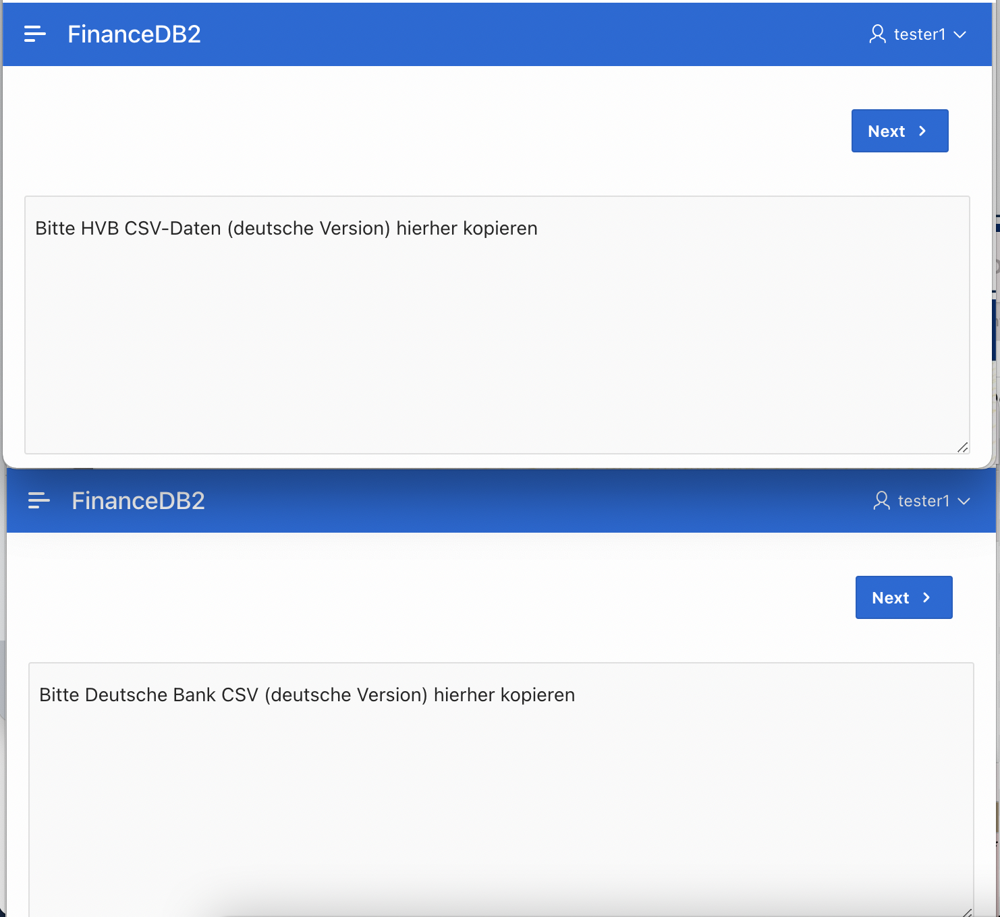

# apex_konten_bewegungen
Für Leute oder Organisationen, die mehrere Bankkonten haben und trotzdem alle Bewegungen dieser verschiedenen Konten "unter einem Dach" im Blick behalten wollen

# Warum
Ich habe mehrere Bankkonten bei mindesten zwei verschiedenen Banken. Alle dieser Banken bieten den Kunden Kontoauszüge als CSV-Downloads an. Im Laufe der Zeit können sich Hunderte von CSV-Files ansammeln, die zudem verschiedenen Aufbau haben. Die Deutsche Bank bietet zum Beispiel CSV in deutscher und englischer Sprache an, mit vielen sehr detaillierten Felder, z.B. "Anzahl der Schecks" oder "Fremde Gebühren". Die HypoVereinsbank/UnitCredit hat dagegen weniger Felder, und die Felder heissen natürlich ein bisschen anders.

Wollte ich zum Beispiel wissen, wieviele Gutschrift ich in einer bestimmten Periode mit einem ungefährem Betrag bekommen habe, wäre es natürlich sehr lästig, durch diese Hunderte von CSV-File zu wühlen. Als jemand, der Know-How in RDBMS- und APEX-Webtechnologie hat, liegt es nahe, eine APEX-Anwendung zu bauen. Dabei sollen für die Anwender sollen folgende Grundsätze gelten:

- Möglichst wenig manuelle Arbeit zum Einpflegen der Daten
- Komfortables Anzeigen der Transkationen verschiedener Konten in einer einzigen Reportseite
- Komfortable Filtermöglichkeiten

Im Laufe der Umsetzung habe ich noch einige andere Features hinzugefügt, auf die ich hier aber nicht eingehe.

# GUI übersicht 
Es gibt hauptsächlich zwei Use-Cases
1. Copy und Paste der CSV-Texte, die Ihnen Ihre Bank online zur Verfügung stellte, in einer der mehrere "CSV-Daten-Laden" Masken. Wenn man zum Beispiel vierteljährlich ein CSV-Download für die letzen 3 Monate runterlädt und sofort die Daten aus der Datei in die APEX-Anwendung lädt, fällt diese Arbeitscchritt nur 1 mal pro Quartal, pro Konto an.
    
2. Anzeigen der Kontobewegungen (Transaktion) in einer Report-Maske mit verschiedenen interaktiven und komfortablen Filtermöglichkeiten (Facet Search)
    

# Infrastruktur 
Für diejenigen, die sich noch nicht mit APEX beschäftigt haben, sich aber zu einem Einstieg trauen, wäre diese Anwendung etwas, das für den Beginner sich eignet und einen reellen Nutzen hat. 

Ich habe die Anwendung auf einer "always-free" (Autonomous Transaction Processing) ATP-Datenbank in der Oracle Cloud entwickelt. Diese Datenbank enthält eine fertig installierte APEX-Instanz. Es handelt sich um eine Oracle 21 Datenbank, wobei der Cloud-Nutzer, also ich, ein DBA-Account bekomme und mit Hilfe eines Wallets auch per SQL Developer oder Sqlplus auf die Datenbank zugreifen kann. Mit einer ATP hat man die Möglichkeit, mit vielen DBA-Aufgabenstellungen zu experimentieren, ohne eine eigene VM oder Server betreiben und die Datenbank selbst installieren zu müssen.
 
Nutzen tue ich die Anwendung mit einem kostenlosem Account bei https://apex.oracle.com/pls/apex, also ebenfalls in der Oracle Cloud. Hinter diesem APEX-Workspace verbirgt sich ebenso eine Oracle 21 Datenbank. Genau genommen entspricht jeder Account einem Datenbankschema und einem APEX-Workspace. Jeder kann bei Oracle ein solches Account beantragen. Mit diesem Account kann man SQL Befehle nur im SQL Workshop der webbasierter APEX-GUI ausführen. Zugriffe über andere Oracle Client sind nicht erlaubt. SQL-Skripte müssen zur Ausführung hochgeladen werden, was eine versionierte Entwicklung fast unmöglich macht. 

Ich habe mit für die Konfiguration: ATP als Entwicklung, APEX-Instanz als "Produktion" entschieden, denn 
- ATP erlaubt Oracle Client Zugriffe, ermöglicht daher repository-basierte Entwicklung
- Die Release-Nummer der ATP-Instanz ist nach meiner Erfahrung immer niedriger als die APEX-Instanz. Der Export der Anwendung aus einer niedrigen Release und Import in eine Instanz mit höheren Release funktioniert gut. Umgekehrt ist es wohl unmöglich.

Stand der APEX-Release am 2022.03.12:
- 21.1.7 ATP        
- 21.2.4 APEX-Only   

Wenn man im Haus bereits eine funktionierende APEX-Instanz mit der passenden Release hat, muss nur noch die Anwendung installiert werden. Siehe weiter unten. Gewisses Niveau an Knowhow im Umgang mit der Oracle-Datenbank wird vorausgesetzt.

# Privatsphäre
Diese Anwendung ist so geschrieben, dass keine schützenswerte Daten (zum Beispiel Kontonummer) im APEX- oder SQL-Code auftauchen. Zum Konfigurieren der Bank-Aliase und IBAN-Nummer *wird* es eine Admin-Maske geben. Wenn man die Kontobewegungsdaten hochgeladen hat, sind diese natürlich sichtbar für alle, die Zugriff auf die Oracle-Datenbank oder auf die APEX-Anwendung haben.

# Installationsanleitung
1. Sicherstellen, dass ein geeignetes Datenbank-Schema für die benötigten Tabellen, View, Stored Procedures etc verfügbar ist.
2. Sicherstellen, dass ein geeignetes APEX-Workspace da ist
3. Sicherstellen, dass ein geeignetes APEX-Entwicker-Account da ist
4. Sicherstellen, dass Anwender für die APEX-App existieren. Zur Not kann der APEX-Entwickler-Account als Anwender fungieren. 
5. Dieses GIT-Repository downloaded oder clonen
6. Den vollen OS-Pfad bis zum subdirectory supporting_objects/lam bereit halten. Ich habe meine Datenbankobjekte im Schema LAM angelegt und deshalb das Verzeichnis so benannt.
7. Wenn Sie direkt Zugriff auf die Oracle-Datenbank haben mit dem oben erwähten User anmelden können: das Skript supporting_objects/lam/lam-deploy-01.sql mit SqlDeveloper oder SqlPlus ausführen. Dabei den oben erwähnteh OS-Pfad als erster Parameter übergeben.
8. Wenn Sie keinen direkten Zugriff auf die Oracle-Datenbank haben, das heißt, Sie können nur über APEX-SQL-Workshop  SQL-Befehle ausführen, bleibt vorerst nichts anderes übrig als die im am-deploy-01.sql referenzierten Unterskripten zu einem einzigen Skript zu konkatinieren. Danach führt man das konkatinierte Script im Workshop aus.
9. In einigen Stored Procedures wird ein Logging-Package referenziert. Es ist nur eine Hilfe für Problemanalyse. Wenn die aufgerufenen Prozeduren in it einer Dummy-Implementation ersetzt, funktioniert die Anwendung genauso. Das Logging-Package und die benötigten Tabellen sind einem anderen GIT-Repository zu finden (URL noch einzufügen!). Andere Lösung ist, die Aufrufe auszukommentieren oder entfernen. Ich würde auskommentieren vorziehen. Weil wenn man die Anwendung selbst weiterpflegen und debuggen möchte, sind die Aufrufe schon sinnvoll. 
10. Nachdem die supporting objects angelegt sind, importiert man mit "App-Builder -> Import" das File FinanceDB2-apex-export.sql

# Kurzanleitung für Anwender
Danach kann man sich als Anwender anmelden und es kann losgehen. 
- Bevor man die Kontoauszüge hochladen kann, muss man zuerst auf der Seite "Bank/Konten einpflegen" die Banknamen und Kontonummer/IBAN einmalig eingeben. Denn die von den Banken bereit gestellten CSV-Files enthalten in der Regel im Datensatz keine Information darüber, auf welches Konten die Daten sich beziehen. Dieselbe Kontonummer in jedem Datensatz zu wiederholen wäre auch masslos.
- Beim Hochladen der CSV-Daten gibt es zwei Variantlen. In beiden Fällen muss darauf geachtet werden, dass die Kopfdaten oder Trailerdaten mitgenommen werden. Die Anwendung akzeptiert nur die Textzeilen, von denen jede einen Transaktionsdatensatz enthält.
    - Copy and Paste der Textzeilen
    - Drag anbd Drop einer CSV-Datei. Eventuell vorher Kopf- und Trailerdaten entfernen!
- Es gibt eine Seite, in der man versehentlich hochgeladenen Transaktionen/Bewegungen zu einem Zeitraum und Konto entfernen kann. So eine Aktion wird auditiert. Die Auditing-Information ist aber derzeit über die GUI nicht sichtbar.

# Sonstige konzeptionelle Hinweise
- Für jede Bank wird eine Import-Tabelle verwendet, weil jede Bank eine eigene CSV-Strkutur hat. Bislang werden nur die Deutsche Bank und HVB berücksichtigt. Für jede andere Bank muss man noch eine neue Import-Tabellen anlegen und die entsprechenden Seiten zum Hochladen erstellen.
- Es wird die "Data Source" Feature von  APEX verwendet. Die hochzuladenden Datensäzte landen zuerst in der entsprechende Import-Tabelle 
- Die Datensätze jeder Bank bzw. Importtabelle nwerden in eine Haupttabelle überführt und dabei eine technische ID pro Datensatz erzeugt. Die Haupttabelle hat mehr Felder, die vermutlich leer bleiben werden, da die CSV-Datei keine entsprechende Felder liefert. Pro CSV-Struktur gibt es eine Mapping-Prozedur für die Überführung in die Haupttabelle.
- Eine Erweeniterung der Anwendung, um verschiedene Berechtigungsrolle zu definieren, ist wünschenswert. Das Löschen von geladenen Transaktion oder Einpflegen neues Bankkontos sollten zum Beispiel nur privilegierten Anwendern vorbehalten sein.
