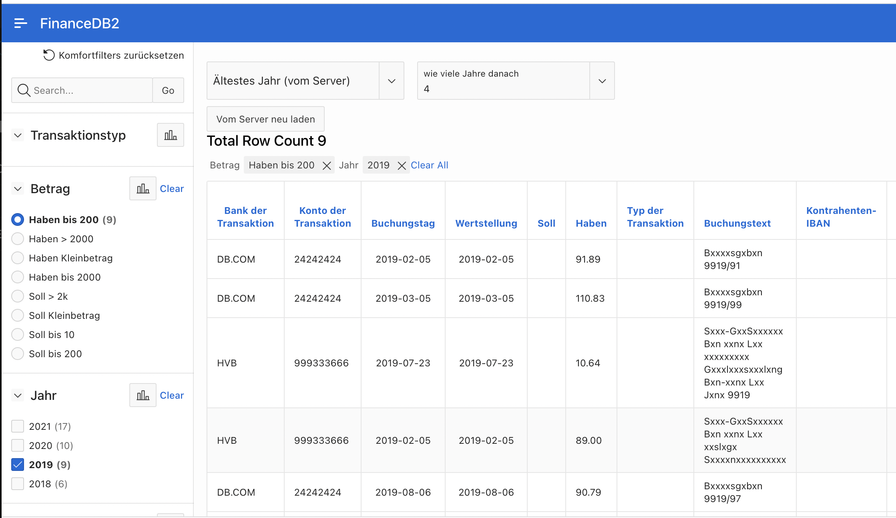

# apex_konten_bewegungen
Für Leute oder Organisationen, die mehrere Bankkonten haben und trotzdem alle Bewegungen dieser verschiedenen Konten "unter einem Dach" im Blick behalten wollen

# Warum
Ich habe mehrere Bankkonten bei mindesten zwei verschiedenen Banken. Alle dieser Banken bieten den Kunden die Auszüge als CSV-Downloads an. Im Laufe der Zeit können sich hunderte von CSV-Files ansammeln, die zudem verschiedenen Aufbau haben. Die Deutsche Bank bietet zum Beispiel CSV in deutscher und englischer Sprache an, mit vielen sehr detaillierten Felder, z.B. "Anzahl der Schecks" oder "Fremde Gebühren". Die HypoVereinsbank/UnitCredit hat dagegen weniger Felder, und die Felder heissen natürlich ein bisschen anders.

Wollte ich zum Beispiel wissen, wieviel Geld ich in einer bestimmten Periode ausgegeben habe, wäre es natürlich sehr lästig, durch diese Hunderte von CSV-File zu kramen. Als jemand, der sich für RDBMS- und APEX-Webtechnologie begeistert, liegt es nahe, eine APEX-Anwendung zu bauen. Für die Nutzer sollen folgende Grundsätze gelten:

- Möglichst wenig manuelle Arbeit zum Einpflegen der Daten
- Komfortables Anzeigen der Transkationen verschiedener Konten in einer einzigen Reportseite
- Komfortables Filtermöglichkeiten im Report 

# GUI übersicht 
Es gibt hauptsächlich zwei Use-Cases
1. Copy und Paste der CSV-Texte, die Ihnen Ihre Bank online zur Verfügung stellte, in einer der mehrere "CSV-Daten-Laden" Masken. Wenn man zum Beispiel vierteljährlich ein CSV-Download für die letzen 3 Monate runterlädt und sofort die Daten aus der Datei in die APEX-Anwendung lädt, fällt diese Arbeitscchritt nur 1 mal pro Quartal, pro Konto an.
2. Anzeigen der Kontobewegungen (Transaktion) in einer Report-Maske mit verschiedenen interaktiven und komfortablen Filtermöglichkeiten (Facet Search)

# Technologie und Installationsanleitung
Die Anwendung wurde mit einem kostenlosem Account bei https://apex.oracle.com/pls/apex/ entwickelt. Dahinter verbirgt sich eine Oracle 21.2 Datenbankschema und die gleichlaufende APEX Version.

Zur Installation der Anwendung für die eigene Nutzung gibt es wohl diese Möglichkeiten
- Sie verschaffen sich selbst ein Konto bei dem obengenannten Oracle Dienst. Ihre Kontendaten würden dann bei Oracle gehostet, mit den entsprechenden Implikationen.
- Sie installieren seblst oder haben bereits eine Oracle 21 Datenbank mit APEX Version 21.

# Privatsphäre
Diese Anwendung ist so geschrieben, dass keine Daten Ihrer (bzw. meiner) Konten im APEX oder SQL-Code auftauchen. Zum Konfigurieren der Bank-Aliase und IBAN-Nummer *wird* es eine Admin-Maske geben. Wenn man die Transaktionsdaten über die Datenlade-Masken eingepflegt hat, sind diese natürlich sichtbar für alle, die Zugriff auf die Oracle-Datenbank oder auf die APEX-Anwendung haben.
